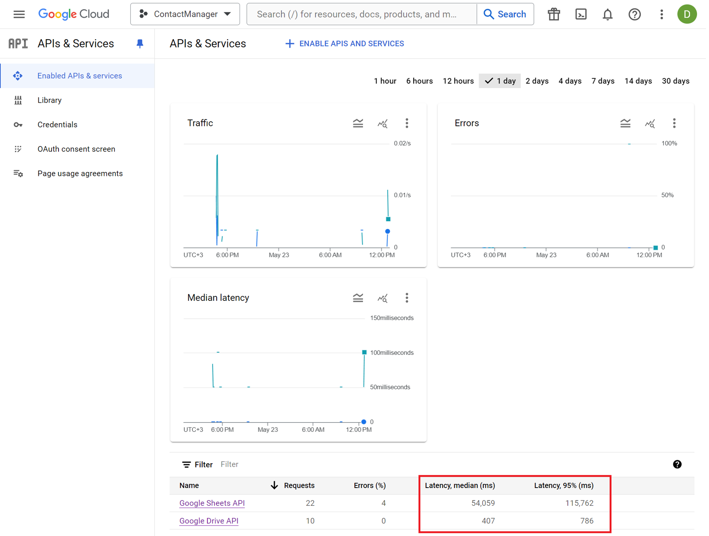
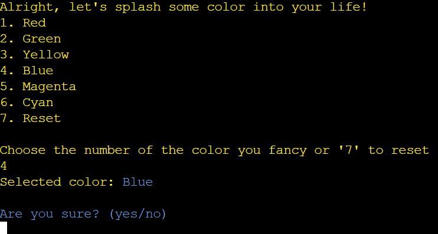

## 📞 **[Live application](https://contact-manager-pp3-f1ca0d7e5b14.herokuapp.com/)**
##### In order to open the application in a new tab, please hold **Ctrl** and left click or click it with your **mousewheel** if you're on Windows machine - hold **Command key** and left click if you're on Mac.

# Purpose of the project
   The purpose of the [Contact Manager](https://contact-manager-pp3-f1ca0d7e5b14.herokuapp.com/) is to allow users to create and manage their contacts in different tabs like  **Name**, **Telephone Number**, **Email**, **Birthday**, **Notes** and sort them as **Personal - Professional - Emergency - Favorites** inside a terminal environment.


## ⚠️ **WARNING** ⚠️

The program may take longer to load due to poor read latency on the *Google Sheets API (GetSpreadsheet)*.

<details>
  <summary><strong>Click here to view the graphs</strong></summary>
  
  
  
  
  
  
</details>

## Navigate to the README Sections

1. [User Stories 🌟](#user-stories-)
    - [First Timer 🚀](#first-timer-)
    - [Frequent User ✨](#frequent-user-)
2. [Features 📋](#features-)
    - [Select Different Input Colors 🎨](#select-different-input-colors-)
    - [View Contacts 👀](#view-contacts-)
    - [Add Contacts ➕](#add-contacts-)
    - [Search Contacts 🔍](#search-contacts-)
    - [Edit Contacts 🖋️](#edit-contacts-)
    - [Delete Contacts 🗑️](#delete-contacts-)
    - [Main Menu 🏠](#main-menu-)
3. [Technology Stack ⚙️](#technology-stack-)
    - [Overview](#overview)
    - [Libraries and Packages Used](#libraries-and-packages-used-)
    - [ANSI Escape codes and ASCII Art](#ansi-escape-codes-and-ascii-art-)
    - [Flowchart 🗺️](#flowchart-)
4. [Testing 📝](#testing-)
    - [Python Validation](#python-validation-)
    - [Test Cases](#test-cases-)
    - [Fixed Bugs 🐛](#fixed-bugs-)
5. [Deployment 🌐](#deployment-)
6. [Credits 🙏](#credits-)


##  User Stories 🌟

###  First Timer 🚀
🌿 **As a first timer, I'd like to:**
- **Add:** Seamlessly add my friends, colleagues, and relatives to my contacts list.
- **Organize:** Categorize contacts into Personal 🏠, Professional 💼, Emergency 🚨, and Favorites ⭐.
- **Access:** Navigate my contacts with an intuitive and visually appealing interface.
- **Manage:** Easily view, search, edit, and delete contacts with a keystroke.
- **Experience:** Enjoy a delightful and user-friendly program, even without any prior experience with terminal-based applications.

###  Frequent User ✨
🌟 **As a returning user, I want to:**
- **Access:** Quickly retrieve previously added contacts for efficient communication.
- **Search:** Effortlessly search for contacts by name, phone number, email, or birthday.
- **Personalize:** Customize my experience by setting preferred input prompt colors and interface themes.
- **Manage:** Streamline contact management tasks with powerful batch editing and deletion features.
- **Expect:** Rely on the program's reliability, responsiveness, and lightning-fast performance for all my contact management needs.


## Features 📋

###  Select Different Input Colors 🎨

- **Customization:** Users can personalize their experience by selecting from a vibrant palette of 6 colors, including Red, Green, Yellow, Blue, Magenta, and Cyan.
- **Reset:** With just a click, users can revert to the program's default color scheme to maintain consistency and clarity.

###  View Contacts 👀

- **Comprehensive Display:** Experience a detailed overview of all existing contacts, complete with every field meticulously organized for easy reference.

###  Add Contacts ➕

- **Effortless Addition:** Seamlessly add new contacts across four distinct categories: Personal, Professional, Emergency, and Favorites.
- **Flexible Fields:** Capture all essential contact details, including **Name**, **Telephone Number**, **Email Address**, **Birthday**, and **Notes**.

###  Search Contacts 🔍

- **Efficient Search:** Quickly locate specific contacts by **Name**, **Telephone Number**, **Email Address**, or **Birthday** using both letters and numbers.
- **Case Insensitive:** Enjoy hassle-free searching as the program ignores case sensitivity, ensuring accurate results every time.

###  Edit Contacts 🖋️

- **Customization Options:** Modify contact details with ease, providing flexibility and control over every aspect of your contact list.

###  Delete Contacts 🗑️

- **Streamlined Deletion:** Effortlessly remove unwanted contacts, whether it's clearing an entire category or targeting specific individuals for deletion.

###  Main Menu 🏠

- **Intuitive Navigation:** Seamlessly navigate between different program functionalities using simple numeric inputs, making it easy to find what you need.


##  **Technology Stack** ⚙️ 

### **Overview**

The project structure is built upon the [Code Institute P3 template](https://github.com/Code-Institute-Org/p3-template), including custom Python code, along with the integration of ANSI escape codes and ASCII art for visual appeal and user interface enhancement.

### Tools 🛠️
- **Git** Used for version control eg. **`git`** `add - commit - push`
- **Github** Used as the hosting platform for the repository.
- **Gitpod** Used as the IDE for writing, editing and debugging code.
- **Heroku** Used for deploying the application.

### API 🔌
- **Google Sheets** Used for managing data stored in Google Sheets.
- **Google Drive** 

### Libraries and Packages Used

```python
import gspread
import re
import time
import sys
from tabulate import tabulate
from google.oauth2.service_account import Credentials

"""
Requirements
"""
cachetools==5.3.3
google-auth==2.29.0
google-auth-oauthlib==1.2.0
gspread==6.1.0
numpy==1.26.4
oauthlib==3.2.2
opencv-python==4.9.0.80
pyasn1==0.6.0
pyasn1_modules==0.4.0
requests-oauthlib==2.0.0
rsa==4.9
StrEnum==0.4.15
tabulate==0.9.0
```
### ANSI Escape codes and ASCII Art
```python
# ANSI Escape codes
COLORS = {
    'red': '\033[91m',
    'green': '\033[92m',
    'yellow': '\033[93m',
    'blue': '\033[94m',
    'magenta': '\033[95m',
    'cyan': '\033[96m'
}
RESET = '\033[0m'

# Ascii art
ascii_art = r'''
  /$$$$$$                        /$$                           /$$
 /$$__  $$                      | $$                          | $$
| $$  \__/  /$$$$$$  /$$$$$$$  /$$$$$$    /$$$$$$   /$$$$$$$ /$$$$$$
| $$       /$$__  $$| $$__  $$|_  $$_/   |____  $$ /$$_____/|_  $$_/
| $$      | $$  \ $$| $$  \ $$  | $$      /$$$$$$$| $$        | $$
| $$    $$| $$  | $$| $$  | $$  | $$ /$$ /$$__  $$| $$        | $$ /$$
|  $$$$$$/|  $$$$$$/| $$  | $$  |  $$$$/|  $$$$$$$|  $$$$$$$  |  $$$$/
 \______/  \______/ |__/  |__/   \___/   \_______/ \_______/   \___/
 /$$      /$$
| $$$    /$$$
| $$$$  /$$$$  /$$$$$$  /$$$$$$$   /$$$$$$   /$$$$$$   /$$$$$$   /$$$$$$
| $$ $$/$$ $$ |____  $$| $$__  $$ |____  $$ /$$__  $$ /$$__  $$ /$$__  $$
| $$  $$$| $$  /$$$$$$$| $$  \ $$  /$$$$$$$| $$  \ $$| $$$$$$$$| $$  \__/
| $$\  $ | $$ /$$__  $$| $$  | $$ /$$__  $$| $$  | $$| $$_____/| $$
| $$ \/  | $$|  $$$$$$$| $$  | $$|  $$$$$$$|  $$$$$$$|  $$$$$$$| $$
|__/     |__/ \_______/|__/  |__/ \_______/ \____  $$ \_______/|__/
                                            /$$  \ $$
                                           |  $$$$$$/
                                            \______/

'''
```


<details>
  <summary><strong>Click to view libraries and packages details</strong></summary>

- **cachetools**: Provides caching utilities.
- **google-auth**: Handles authentication for Google APIs.
- **google-auth-oauthlib**: Google authentication with OAuth.
- **gspread**: Interacts with Google Sheets.
- **numpy**: Performs numerical computations efficiently.
- **oauthlib**: Implements OAuth for Python applications.
- **opencv-python**: Offers computer vision capabilities.
- **pyasn1**: Supports ASN.1 data encoding and decoding.
- **pyasn1_modules**: Additional modules for pyasn1.
- **requests-oauthlib**: Implements OAuth for HTTP requests.
- **rsa**: Implements RSA encryption and decryption.
- **StrEnum**: Implements string enumerations.
- **tabulate**: Formats tabular data for easy display.
</details>

## Flowchart 🗺️

### Used **[Lucid Chart](https://www.lucidchart.com/pages/)** to draw it.

<details>

<summary><strong>Click to view the flowchart</strong></summary>


</details>


## Testing 📝

### Through **[PEP8](https://pep8ci.herokuapp.com/)**

<details>

  <summary><strong>Click to view the python validation</strong></summary>

  

</details>


### Test cases

#### Start

- The **first thing** the users come to see when the land on the program, deciding whether to use the program or not with different outcomes.

  <details>

  <summary><strong>Click to view the main shot and the yes or no outputs</strong></summary>

  ### Main

  
    ### Upon launching the program, users are greeted with an eye-catching ASCII art, setting the tone for their interaction with the application.

  ### Start Confirmation - 'Yes'

  
    ### Users can initiate the program by entering 'yes', signaling their intent to proceed with the contact management functionality.

  ### Start Confirmation - 'No'

  
    ### If users decide not to proceed, they can enter 'no' to terminate the program.

  ### Termination - 'Esc'
  
    ### Alternatively, users can terminate the program at any time by entering 'esc', providing a quick exit option.

  </details>

#### Choose color prompt

- After the user chooses to `use` essentially the program, they come across to the `choose color` functionality. Users can choose up to 6 colors which are *Red - Green - Yellow - Blue - Magenta - Cyan* as their input color, upon selecting one (1 - 6), then a `confirmation prompt` will appear to the users to hit `yes or no`, if the input is `yes` then the program continues with the selected color, else it loops back. The users can also turn the color back to default by entering `7`.

    <details>

    <summary><strong>Click to view the choose color functionality options</strong></summary>

    
    
    
    
    
    
    
    
    

    </details>

#### View existing contact

- Once the user chooses to change the input color (or not), the next thing they'll come to face are the prompt to `View existing contacts` on the program.

  <details>

  <summary><strong>Click to view the view contacts functionality</strong></summary>

  ### Enter 'yes' to choose a category
  
  ### Confirm your choice by entering 'yes' to view contacts

  ### Show existing contacts in Personal
  
  ### See contacts categorized as 'Personal'

  ### Show existing contacts in Professional
  
  ### Display contacts labeled as 'Professional'

  ### Show existing contacts in Emergency
  
  ### View contacts listed under 'Emergency'

  ### Show existing contacts in Favorites
  
  ### Display contacts marked as 'Favorites'

  ### Show all existing contacts in all Categories
  
  ### View all contacts across categories

  ### Don't want to view existing contacts
  
  ### Skip viewing contacts by selecting '6'

  </details>


#### Add contacts

- When the users are done with `viewing existing contacts`, they can **add new contacts** in any of the categories they wish to *Personal - Professional - Emergency - Favorites* and have different fields for each of them as *Name - Telephone number - Email address - Birthday - Notes* (name and telephone number are <ins>**mandatory**</ins>). Or they can just skip this action and move forward, or enter `esc` and terminate the program. Upon `invalid input` provided by the user, a new prompt will keep looping until `valid input` is provided.

  <details>

  <summary><strong>Click to view add contacts</strong></summary>
  
  ### All of the process of adding contacts
  

  </details>

### Search contacts
- Users can search for contacts by *Name - Telephone number - Email address - Birthday*. It's designed to be non-case sensitive, guaranteeing easy access without any obstacles. Additionally, users have the option to skip this process by entering `no` or `esc` to terminate the program.

  <details>
  
  <summary><strong>Click to view search contacts functionality</strong></summary>

  ### Contacts are found
  
  ### Contacts found and displayed on tabulate format 

  ### No contacts found
  
  ### No matching contacts were found in the search results

  </details>

#### Edit contacts

- Users can **edit existing contacts** by choosing the `edit contacts` option. They start by selecting a category from which they want to edit contacts, such as **Personal** or **Professional**. Then, they choose the specific contact they wish to edit. Users can modify various fields like **Name**, **Telephone Number**, **Email**, **Birthday**, and **Notes**. After making the edits, they see a confirmation message and the updated contact details are displayed. Finally, users can continue editing contacts, move to the next functionality of the program,return to the `main menu` or `terminate` the program.


  <details>

  <summary><strong>Click to view edit contacts functionality</strong></summary>

  ### Edit contacts
  
  ### Showcase step by step the process of editing a contact

  </details>


#### Delete contacts

- Users can **delete contacts** 


  <details>

  <summary><strong>Click to view delete contacts functionality</strong></summary>

  ### The process of deleting all contacts in a specific category
  
  ### Also in this case if the user decides to delete all contacts in all categories, there will be a new confirmation prompt

  ### The process of deleting individual contacts
  

  </details>


#### Main menu

- asda

    <details>

    <summary><strong>Click to view main menu</strong></summary>
    screenshot for main menu

    </details>


## Fixed bugs 🐛


## Deployment 🌐

- via Heroku
  - asd
- via git clone
  - asd


## Credits 
- Used ***[rxaviers](https://gist.github.com/rxaviers/7360908)*** Complete list of github markdown emoji markup
- Used [ChatGPT 3.5](https://chatgpt.com/?oai-dm=1) and [Codeium](https://codeium.com/) for minor improvements and better explanation on my
requests for this project.
- The main idea for this project was obtained by the [Love Sandwiches]() walkthrough project of the [Code Institute course](https://codeinstitute.net/global/).

  ### 🙏 **𝓢𝓹𝓮𝓬𝓲𝓪𝓵 𝓣𝓱𝓪𝓷𝓴𝓼 𝓽𝓸 𝓼𝓸𝓶𝓮 𝓯𝓪𝓫𝓾𝓵𝓸𝓾𝓼 𝓹𝓮𝓸𝓹𝓵𝓮** 🙏
  - 📠**ğ•½ğ–”ğ–ğ–ğ–™** - **Code Institute Mentor** [](https://github.com/rohit0286)
  - 🚀 **𝓓𝓪𝓲𝓼𝔂** [](https://www.linkedin.com/in/daisy-mcgirr/) [](https://github.com/Dee-McG)
  - 🥇 **𝓙𝓾𝓪𝓷 𝓪𝓷𝓭 𝓞𝓷𝓵𝔂** [](https://www.linkedin.com/in/juan-boccia/) [](https://github.com/jbocciadev)
  - ⭐️ **𝓥𝓮𝓻𝓷𝓮𝓵𝓵** [](https://www.linkedin.com/in/vernellclark/) [](https://github.com/VCGithubCode)